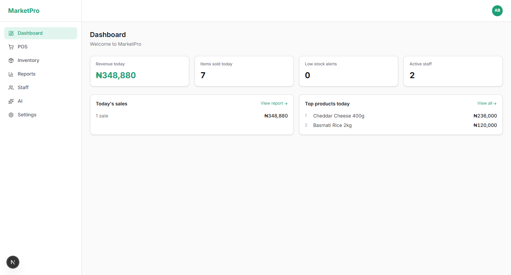
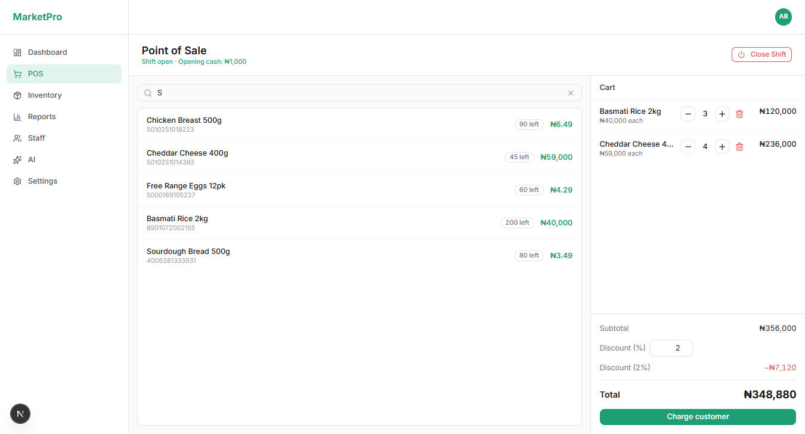
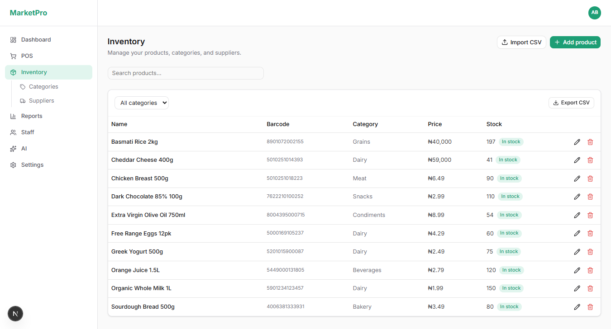
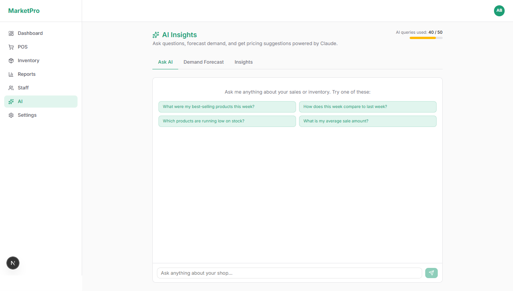

# MarketPro — POS & Inventory Management for Nigerian Shops

> Built by **Amiolemen Best**
> 📧 bestolumese@gmail.com &nbsp;·&nbsp; 📱 +2348136345358 (WhatsApp)

---

MarketPro is a complete point-of-sale and business management platform built specifically for small supermarkets, provision stores, and market shops across Nigeria and West Africa. Everything a shop owner needs — from ringing up a sale to understanding profit margins — is in one place, accessible from any device with a browser.

---

## Screenshots

| Dashboard | POS Checkout |
|-----------|-------------|
|  |  |

| Inventory | AI Insights |
|-----------|------------|
|  |  |

---

## What MarketPro Does

### Point of Sale (POS)
Ring up sales in seconds from any device. Add items by search or barcode scan, apply discounts, and collect payment by cash, card, or bank transfer. Receipts are generated instantly and every sale is recorded in real time. Works even without internet — transactions sync automatically once the connection returns.

### Inventory Management
Keep track of every product in your shop. Set low-stock thresholds and get alerts before you run out. Organise products by category and supplier. Bulk import your entire product list from a CSV file in minutes. Export your inventory, categories, and supplier list to CSV at any time.

### Sales Reports & Analytics
See exactly how your business is performing. Daily, weekly, and monthly sales summaries. Profit reports that account for cost price. Top-selling products ranked by revenue. Staff performance reports showing each cashier's contribution. All data can be exported to CSV or PDF for your records or accountant.

### Staff & Role Management
Add your team and assign each person the right level of access:

| Role | What they can do |
|------|-----------------|
| **Owner** | Full access to everything including billing and settings |
| **Manager** | Full access except billing |
| **Accountant** | Read-only access to inventory, reports, and AI insights |
| **Inventory Manager** | Full inventory control — no POS or financial data |
| **Cashier** | POS only, their own shift data, and their account settings |

Invite staff by email. They receive an invitation link, sign up, and are immediately placed in the right role. Remove a staff member and their access is revoked instantly.

### Shift Management
Cashiers clock in and out of shifts. Each shift tracks total sales made, items sold, and cash collected. Managers and owners can review all shifts and identify discrepancies at any time.

### AI-Powered Business Insights
Ask MarketPro questions about your business in plain English:

- *"What were my best-selling products this week?"*
- *"Which products are running low on stock?"*
- *"How does this week compare to last week?"*
- *"What is my average sale amount?"*

The AI also provides:
- **Demand forecasting** — predicts how many units to restock and estimates days until stockout
- **Anomaly detection** — flags unusual discounts, abnormal sales patterns, or suspicious voids
- **Pricing suggestions** — recommends optimal selling prices based on your sales data
- **Weekly digest** — a full business summary generated on demand

### Works Offline
MarketPro is a Progressive Web App (PWA). When your internet drops, the POS keeps working. All sales made offline are stored on the device and automatically synced when the connection returns. Your business never stops because of network issues.

### Bank Transfer Support
Accept bank transfer payments at checkout. Customers transfer to your registered bank accounts while the cashier confirms and records the payment. Multiple bank accounts can be configured in settings.

---

## Plans & Pricing

| Plan | Price | Best for |
|------|-------|----------|
| **Starter** | Free | New shops — up to 50 products and 2 staff accounts |
| **Growth** | ₦9,900 / month | Growing shops — unlimited products and staff, full reports, AI features |
| **Pro** | ₦19,900 / month | Established shops — all features plus priority support |

All paid plans can be cancelled at any time. No contracts, no lock-in. You keep full access until the end of your billing period after cancellation.

---

## Payments — Secured by Paystack

All subscription billing is processed through **Paystack**, Nigeria's leading payment infrastructure provider. Paystack is PCI-DSS compliant and is trusted by thousands of Nigerian businesses including banks, fintechs, and retailers.

- Your card or account details are **never stored** on MarketPro's servers
- All payment transactions are encrypted end-to-end
- Subscriptions can be cancelled at any time from your billing settings
- You retain full access until the end of your current billing period after cancelling

---

## Security

MarketPro is built with security as a foundation, not an afterthought.

**Account Security**
- Email verification is required on sign-up — no unverified account can access the dashboard
- Secure session management with automatic expiry on inactivity
- Google Sign-In available as a trusted authentication option
- All passwords are hashed using industry-standard algorithms and never stored in plain text

**Access Control**
- Every staff role has strict access boundaries enforced at both the page level and the server API level
- A cashier cannot access reports, inventory management, or settings — even if they know the URL directly
- An accountant cannot make any changes — only view data
- Role changes take effect immediately with no delay

**Data Protection**
- All data is stored in an encrypted, enterprise-grade cloud database
- All communication between your browser and MarketPro's servers is protected by HTTPS/TLS encryption
- Each shop's data is completely isolated — no shop can ever access another shop's data
- Soft deletion is used for staff and product records — data is recoverable if removed by mistake

**Invitation System**
- Staff can only join your organisation via an explicit email invitation sent by an Owner or Manager
- Invitation links are time-limited and expire automatically after 48 hours
- Removing a staff member immediately and permanently terminates their access

---

## Getting Started

1. Visit [marketpro.ng](https://marketpro.ng) and click **Start for free**
2. Create your account and verify your email address
3. Complete the onboarding — enter your shop name and set up your first products
4. Invite your team from **Settings → Team**
5. Open the POS and start selling

---

## Support & Enquiries

For support, demo requests, partnership enquiries, or any questions:

| | |
|---|---|
| **Email** | bestolumese@gmail.com |
| **WhatsApp** | +2348136345358 |

---

Built and maintained with care by **Amiolemen Best**.

*MarketPro — The smarter way to run your shop.*
